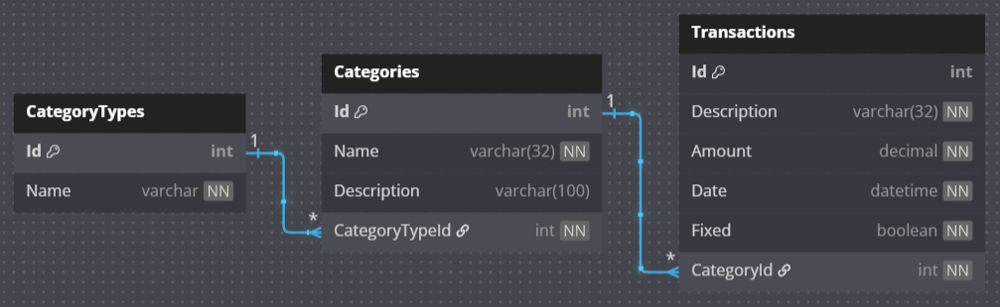

# 💸 Expense Tracker API

A RESTful Web API for managing personal expenses, built with **ASP.NET Core**.  
It allows users to add, update, delete and retrieve financial transactions, making it ideal for integration with front-end apps or mobile clients.

This project was developed to practice back-end API design, database modeling, and modern .NET practices.

---

## 🚀 Features

- Create new expenses
- Retrieve expense records
- Update and delete entries
- Persistence with a relational database (PostgreSQL)
- API-ready for front-end or mobile integration

---

## ⏳ To be implemented

- Refactor the code with async CRUD operations and better practices
- User Entity and JWT authentication

---

## 💻 Technologies Used

- [.NET 8](https://dotnet.microsoft.com/en-us/)
- C#
- ASP .NET Core
- Entity Framework Core
- PostgreSQL
- Docker
- Swagger

---

## ▶️ Executing the project

### 1. Clone the repository

```bash
https://github.com/gmalisse/expense-tracker.git
```

### 2. Install EF Core packages

Navigate to the repository path and run:

```bash
dotnet add package Microsoft.EntityFrameworkCore
dotnet add package Microsoft.EntityFrameworkCore.Design
dotnet add package Npgsql.EntityFrameworkCore.PostgreSQL
```

### 3. Update the connection string in appsettings.json with your local DB credentials.

```bash
"ConnectionStrings": {
  "DefaultConnection": "Host=localhost;Port=5432;Database=ExpenseDb;Username=youruser;Password=yourpassword"
}
```

### 4. Apply existing migrations and populate the database

Run the command below to create the database using the migrations:

```bash
dotnet ef database update
```

## 🛠️ Development Process

**1. Project Setup:**
Created the solution using the ASP.NET Core Web API template, establishing a clean architecture for future scalability.

**2. Domain Modeling:**
Defined the core entities Category, CategoryType and Transaction. Created the properties and data annotations for each one of them, and defined the relationship between entities.

**3. Database Integration:**
Configured Entity Framework Core with PostgreSQL for relational data persistence.
Handled environment variables and connection strings with appsettings.json and used Docker with a docker-compose file for PostgreSQL containerization.

**4. DbContext and Migrations:**
Created the DbContext and migrations. Applied them using the dotnet ef CLI, implementing initial data for the API.

**5. API Implementation:**
Built RESTful endpoints to handle full CRUD operations. CRUD operations were fully implemented for the Transaction and Category entities. The CategoryType entity properties should not be changed, so there is only the Read operation.
Tested endpoints manually and documented the behavior with Swagger for easy inspection.

